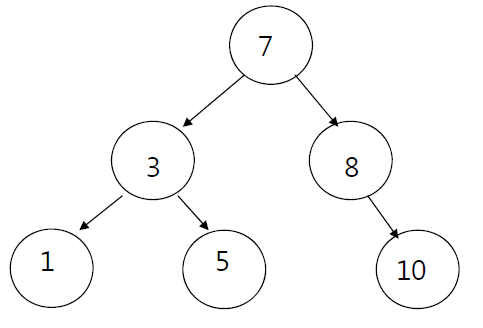

# 이진탐색트리
## 이진탐색트리
- 이진탐색(binary search)과 연결리스트(linked list)를 결합한 자료구조의 일종이다.
- 이진탐색의 효율적인 탐색 능력을 유지하면서도 빈번한 자료 입력과 삭제를 가능하게끔 고안되었다.
- 이진탐색의 경우 탐색에 소요되는 계산복잡성은 O(lon g)으로 빠르지만 자료 입력, 삭제가 불가능하다.
- 연결리스트의 경우 자료 입력, 삭제에 필요한 계산복잡성은 O(1)로 효율적이지만 탐색하는 데에는 O(n)의 계산복잡성이 발생한다.
<image src = "https://i.imgur.com/nCYjtI7.png" width = 300 height = 300>
- 각 노드의 왼쪽 서브트리에는 해당 노드의 값보다 작은 값을 지닌 노드들로 이루어져 있다.
- 각 노드의 오른쪽 서브트리에는 해당 노드의 값보다 큰 값을 지닌 노드들로 이루어져 있다.
- 중복된 노드가 없어야 한다.
- 왼쪽 서브트리, 오른쪽 서브트리 또한 이진탐색트리이다.
---
- 이진탐색트리를 순회할 때는 중위순회(inorder) 방식을 사용한다.
  - 왼쪽 서브트리 - 노드 - 오른쪽 서브트리 순으로 순회한다.
- 이렇게 하면 이진탐색트리 내에 있는 모든 값들을 정렬된 순서대로 읽을 수 있다.

